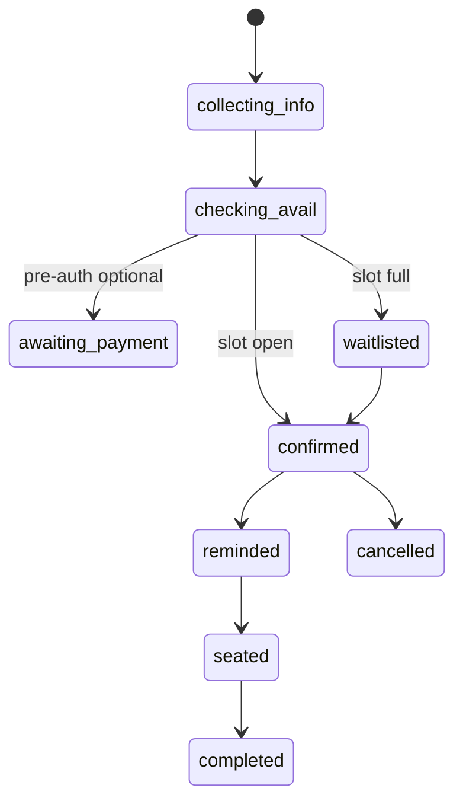

# EasyReserve – Conversational Restaurant Booking Platform

Turn table management into a delightful, automated experience. EasyReserve lets diners chat to book, modify, or cancel reservations while staff stay informed via n8n-powered notifications.

---

## Contents
1. Product Vision
2. User Journeys
3. Feature List
4. Architecture & Tech Stack
5. Data Schema
6. Reservation State Machine
7. APIs & Webhooks
8. Local Setup
9. Deployment Guide
10. Backlog / Enhancements

---

## 1. Product Vision 🥂

Provide a frictionless booking flow that feels like texting a host, reduces phone calls, and captures diner preferences for better hospitality.

## 2. User Journeys 👤

1. **Diner** opens site → asks “Table for 4 this Saturday at 7?” → chatbot confirms → SMS confirmation.
2. **Staff** gets Slack ping when party > 8 → approves or declines in one click → diner notified.
3. **Walk-in** cancels via link in SMS → slot reopens, waitlist guest automatically offered.

## 3. Feature List ✨

• Conversational booking & FAQ (hours, menu)
• Availability calendar sync (iCal export)
• SMS / Email confirmations & reminders
• Wait-list auto-promote
• Dietary preference capture stored per customer
• Admin dashboard for daily manifests

---

## 4. Architecture & Tech Stack  🏗️

Component | Choice | Notes
----------|--------|------
UI | Next.js 14 + Tailwind | Responsive chat widget + admin pages
API | Node.js + Express | REST & SSE for streaming messages
AI | Ollama Llama-3 | Prompt templates for reservation flow
Automation | n8n | Webhook triggers for outgoing comms
Database | PostgreSQL + Prisma | Row-level separation by restaurant
Cache | Redis | Conversation session + rate-limits
Infra | Docker Compose (dev) / Render (prod) | One-click deploy

Sequence:

```
User → /api/chat ───→ LLM (Ollama)
                │
                ├─→ MCP (state machine) ─→ Postgres (holds reservation)
                │
                └─→ n8n webhook → Twilio / SendGrid
```

---

## 5. Data Schema 📊

Table | Fields (excerpt)
------|-----------------
`restaurants` | id, name, tz, seats_total
`customers` | id, phone, email, dietary_prefs
`reservations` | id, restaurant_id, customer_id, status, party_size, ts_start, ts_end, special_request
`waitlist` | id, restaurant_id, customer_id, desired_slot, created_at

FK & unique constraints ensure no double-booking.

---

## 6. Reservation State Machine ⏱️



Each transition emits an n8n webhook event (`reservation.status_changed`).

---

## 7. APIs & Webhooks 📡

HTTP Verb | Endpoint | Description
----------|----------|-----------
POST | `/api/chat` | Stream chat (SSE)
GET  | `/api/reservations?date=YYYY-MM-DD` | List for admin
PATCH| `/api/reservations/:id` | Update status
POST | `/api/webhook/n8n/:flow` | Callback from n8n

Authentication: JWT in `Authorization: Bearer` for admin routes. Public chat is rate-limited per IP.

---

## 8. Local Setup 🛠️

```bash
git clone https://github.com/ArtemisAI/Artemis_Web_Portfolio
cd easyReserve
cp .env.example .env          # fill DB creds, Twilio keys, etc.
docker compose up -d db redis n8n ollama
npm i
npm run dev                   # http://localhost:3000
```

Run tests: `npm test`

---

## 9. Deployment Guide ☁️

1. Create Render Postgres + Redis services.
2. Provision a Web Service from `easyReserve/Dockerfile`.
3. Add environment variables (see `.env.example`).
4. Point `A` record to Render CDN for custom domain.

---

## 10. Backlog / Enhancements 🗺️

• Google Maps place details in chat
• Table layout visual editor for staff
• Loyalty program integrations (Square, Toast)
• Voice booking via Web Speech API

–––

Made with ☕ & TypeScript.
